# Challenge-ForoHub

Este challenge ha sido creado para implementar una api Rest, donde se pueden agregar topics, los cuales constan de un titulo, un mensaje, un usuario, con nombre y email, y un curso que por ahora solo cuenta con el nombre, estos son guardados en una base de datos postgres, y con esa informacion se realizan varias consultas.
https://github.com/MiguelSanchezG/Challenge-Forohub


## Tabla de contenido

- [Tecnologías](#tecnologías)
- [Instalación](#instalación)
- [Uso](#uso)

## Tecnologías

- **Java 21**
- **Spring Boot**
- **Spring Security**
- **JWT (JSON Web Token)** para autenticación
- **Flyway** para migraciones de base de datos
- **PostgreSQL** como sistema de base de datos
- **Maven** para gestión de dependencias
- **IntelliJ IDEA** como entorno de desarrollo
- **Insomnia / Postman** para probar los endpoints de la API
- **pgAdmin** para la administración de la base de datos
- **Git y GitHub** para control de versiones

  
## Instalación
1. Para este caso no es realmente necesaria una instalacion, se puede simplemente copiar el repositorio en la carpeta de tu preferencia:
   ```bash
   git clone https://github.com/MiguelSanchezG/Challenge-Forohub.git
   ```
   
2. puede verificar los archivos y el código abriendo el proyecto con IntelliJ o el IDE de tu preferencia.
3. Es necesario tener pgAdmin, esto para manejar la base de datos, e imsomina o postman, esto para hacer los request.

## Uso

1. Primero es necesario crear la base de datos, esto para evitar algun error al compilar la aplicacion. solo hay que ir al pgAdmin, luego se da click derecho a la opcion postgreSQL17, esto muestra un pequeño menu, donde seleccionaremos Create, y seleccionamos Database.

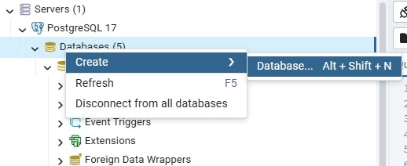

2. Nos saltara una pequeña ventana, y simplemente pondremos el nombre, que en este caso seria forohub y le damos a save

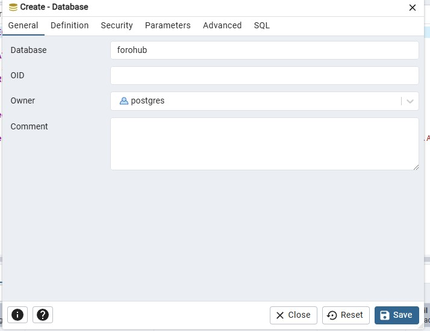


3. ahora vamos a abrir el proyecto con nuestra IDE de preferencia, en este caso se usa IntelliJ, luego buscamos el archivo application.properties, esto para definir cierta informacion necesaria, en este caso, para la prueba, se puede reemplazar.

   -{DB_HOST} por localhost:8080
   
   -{DB_NAME} por forohub
   
   -{DB_USER} por el usuario que definimos en al iniciar por primera vez el pgAdmin
   
   -{DB_PASSWORD} por la contraseña que definimos con ese nombre
   

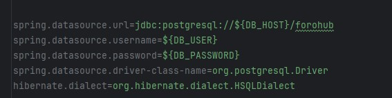

4. Ahora volvemos a las carpetas del proyecto y buscamos la clase ApiApplication

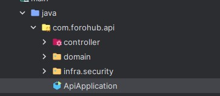


5. Entonces le daremos click derecho en la clase y buscamos la opcion que dice Run

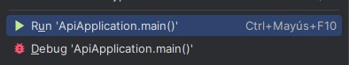


6. despues de la ejecucion del proyecto, las tablas necesarias de la base de datos se crearan, entonces, para poder hacer uso es necesario usar el insert, para generar un perfil y se permita hacer las request. El token generado se creo colocando la contraseña que se desea en bcrypt, que se puede buscar sencillamente en google y luego generarla, poniendo lo generado en la parte de Tokengenerado. tambien se agregan otras consultas para por ejemplo verificar la informacion.

```sql
        SELECT * FROM topicos
        SELECT * FROM perfiles
        insert into perfiles values(1,'prueba@forohub.com','Tokengenerado');
```


7. y ahi empezara la app, la cual para este caso se puede usar el Insomnia o postman. se adjunta el JSON de ejemplo de como se pide la entrada.

```json
      {
      	"titulo":"informacion",
      	"mensaje":"en este momento estamos probando el forohub",
      	"usuario":{
      		"nombre":"miguel",
      		"email":"miguel@gmail.com"
      	},
      	"curso":{
      			"materia":"Matematicas"
      	}
      }
```

8. pero primero, se hara la request del login al URI proporcionado, y en la parte del body agregamos la informacion del login que deberia ser de la siguiente manera, pero segun el perfil que recien se creo, luego copearemos el tokenJWT que nos genera, y este debe pegarse en la parte del AUTH del imsomnia, esto para todos los request de ahora en adelante.

```bash http://localhost:8080/login```

```json
  {
	"login":"miguel.guluma@forohub.com",
	"contrasena":"123456"
  }
```

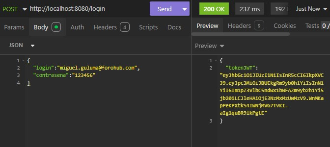

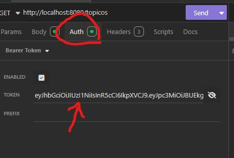

9. empezamos con el post registro topico, se adjunta la URI para el request. aqui debemos usar el ejemplo que se dio de la entrada, segun los datos requeridos para generar el topico, una vez se pone la informacion necesaria solo es cuestion de darle al send, ya esto se comprueba mejor en la base de datos.

```bash http://localhost:8080/topicos ```

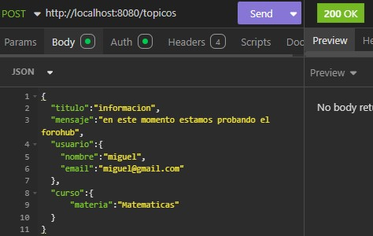

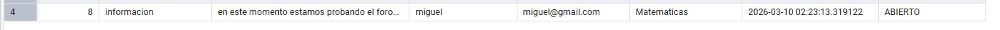

10. ahora el get, es sencillo, solo generar la request get con el siguiente URI. esto nos muestra todos los topicos añadidos. tambien esta la opcion de buscar por id, es solo añadir un "/#" al final del link, se proporciona ejemplo

```bash http://localhost:8080/topicos ```
```bash http://localhost:8080/topicos/8```

      esto seria para ver el topico numero 8

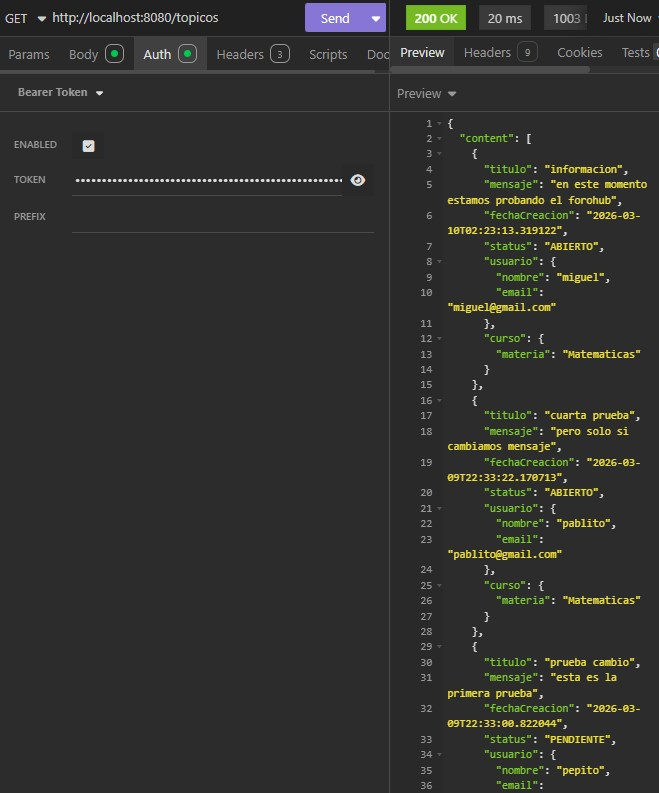
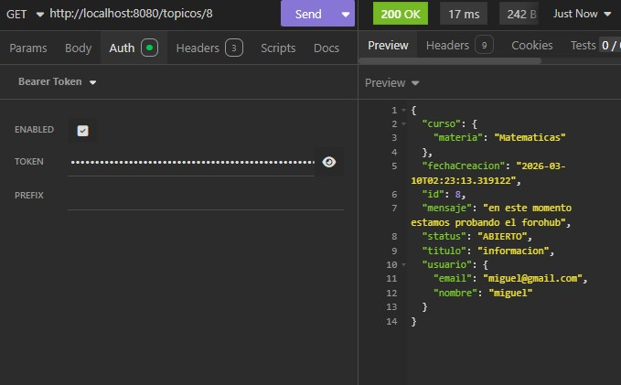

11. ahora el PUT, donde podemos actualizar la informacion que necesitemos, solo es hacer el request con el siguiente link, donde debemos proporcionar tambien el id en la base del JSON

```bash http://localhost:8080/topicos/8 ```

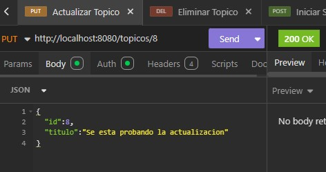


12. por ultimo la eliminacio, donde solo es poner el indice al final del topico que deseemos eliminar. esto se comprueba mejor en la base de datos.

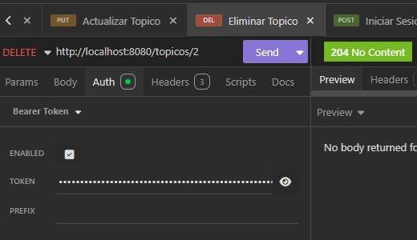
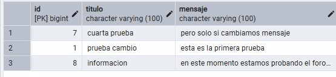

